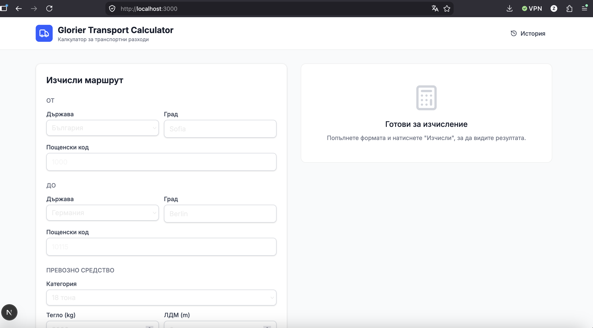
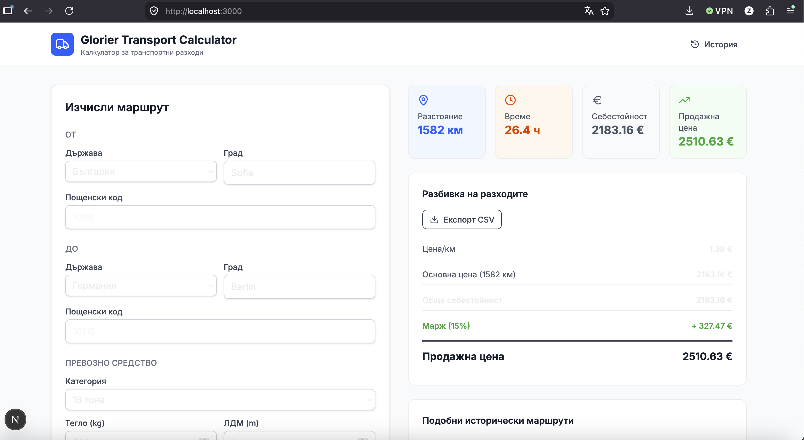
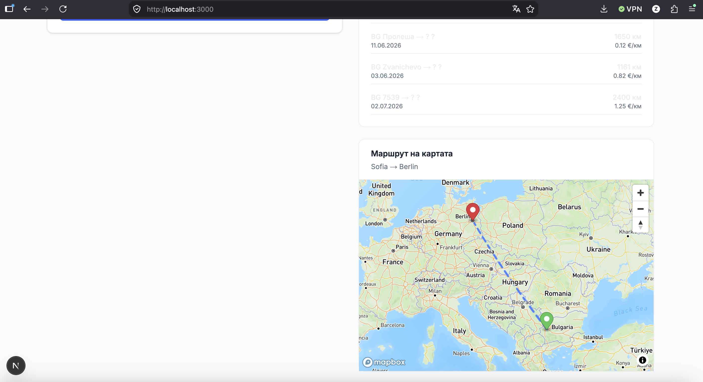
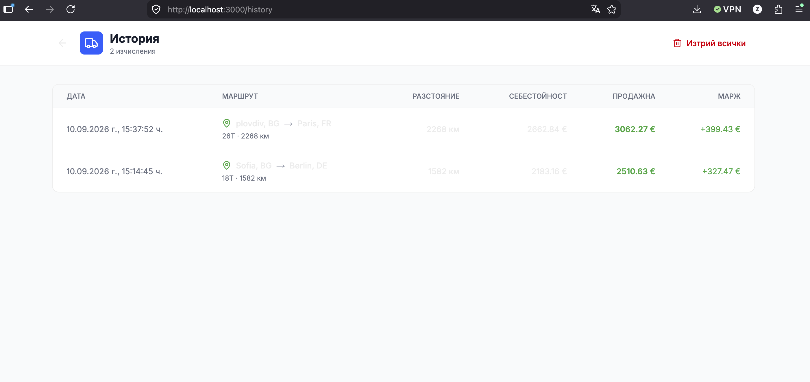

# 🚚 Glorier Transport Calculator

Модерен калкулатор за транспортни разходи, създаден за диспечерите на **Glorier**.

> 🔗 **Живо демо:** [glorier-transport-calculator.vercel.app](https://glorier-transport-calculator.vercel.app)

Модерен калкулатор за транспортни разходи, създаден за диспечерите на **Glorier**.


---
## 📸 Screenshots

### 🖥️ Основен екран – Калкулатор


### 📊 Резултати и разбивка на разходите


### 🗺️ Интерактивна карта с маршрут


### 📚 История на изчисленията


---
## 🎯 Какво прави

- **Изчислява разстояние** между две точки в Европа (Haversine + fallback по държави)
- **Изчислява цена/км** базирана на реални исторически данни (889 записа от TMS)
- **Показва разбивка** на разходите (основна цена, доп. разходи, марж)
- **Визуализира маршрута** на интерактивна карта (Mapbox)
- **Показва подобни исторически маршрути** за сравнение
- **Запазва история** на изчисленията (SQLite + Prisma)
- **Експорт в CSV** за споделяне с клиенти

---

## 🛠️ Технологичен стек

| Технология | Версия | Защо |
|-----------|--------|------|
| **Next.js** | 16 | App Router, Server Components |
| **React** | 19 | Модерен UI |
| **TypeScript** | 5.9 | Типова безопасност |
| **Tailwind CSS** | 4 | Бърз styling |
| **Mapbox GL** | Latest | Интерактивна карта |
| **Prisma** | 6 | ORM за база данни |
| **SQLite** | – | Лека база за прототип |
| **Zod** | 4 | Валидация на данни |
| **Lucide React** | Latest | Икони |

---

## 🚀 Стартиране

### Предварителни изисквания
- Node.js 20+
- npm или yarn

### Инсталация

```bash
# 1. Клонирай проекта
git clone https://github.com/zvHristov/glorier-transport-calculator
cd glorier-transport-calculator

# 2. Инсталирай зависимости
npm install

# 3. Настрой environment
cp .env.example .env.local
# Добави NEXT_PUBLIC_MAPBOX_TOKEN в .env.local

# 4. Инициализация на база
npx prisma db push
npx prisma generate

# 5. Конвертирай Excel → JSON (ако още не е направено)
npx tsx scripts/convert-excel.ts

# 6. Стартирай
npm run dev
```

Отвори [http://localhost:3000](http://localhost:3000).

---

## 📊 Структура на проекта

```
src/
├── app/
│   ├── page.tsx                    # Главна страница (калкулатор)
│   ├── layout.tsx                  # Root layout
│   ├── history/
│   │   └── page.tsx                # История на изчисленията
│   └── api/
│       ├── calculate/route.ts      # API за изчисление
│       └── history/route.ts        # API за история
├── components/
│   ├── RouteForm.tsx               # Форма за входни данни
│   ├── RouteMap.tsx                # Карта с маршрут
│   ├── ResultsPanel.tsx            # Резултати + Export CSV
│   └── ui/
│       ├── Button.tsx              # Reusable бутон
│       └── Input.tsx               # Reusable input/select
├── lib/
│   ├── calculator.ts               # Основна логика
│   ├── geo.ts                      # Географски изчисления
│   ├── excel-parser.ts             # Парсер за данни
│   └── prisma.ts                   # Prisma client
└── types/
    └── index.ts                    # TypeScript типове

data/
├── transport-data.xlsx             # Оригинални данни (не се използва директно)
└── transport-data.json             # Конвертирани данни (използва се)

prisma/
├── schema.prisma                   # База данни схема
└── dev.db                          # SQLite база
```

---

## 📈 Използване на историческите данни

Калкулаторът използва **889 записа** от предоставения TMS файл:

| Категория | Средна цена/км | Мин | Макс | Брой |
|-----------|---------------|-----|------|------|
| **7.5T** | 1.31 €/км | 0.06 | 5.83 | 91 |
| **18T** | 1.50 €/км | 0.04 | 6.57 | 267 |
| **26T** | 1.33 €/км | 0.14 | 2.93 | 32 |
| **40T** | 1.69 €/км | 0.23 | 9.25 | 80 |

**Автоматична отстъпка за дълги разстояния:**
- > 2000 км: -15%
- > 1000 км: -8%
- > 500 км: -3%

**Марж според разстоянието:**
- < 300 км: 25%
- < 800 км: 20%
- < 1500 км: 18%
- ≥ 1500 км: 15%

---

## 🗺️ Карта

Маршрутът се визуализира чрез **Mapbox GL**:
- 🟢 **Зелен маркер** = начало
- 🔴 **Червен маркер** = край
- 🔵 **Пунктирана линия** = приблизителен маршрут
- **Автоматично центриране** според двете точки

---

## 📝 API Endpoints

### `POST /api/calculate`
Изчислява маршрут и запазва в базата.

**Body:**
```json
{
  "origin": { "country": "BG", "city": "Sofia", "postalCode": "1000" },
  "destination": { "country": "DE", "city": "Berlin", "postalCode": "10115" },
  "vehicleType": "18T",
  "weight": 5000,
  "departureDate": "2026-09-10T12:00:00Z"
}
```

**Response:**
```json
{
  "success": true,
  "result": {
    "distance": 1582,
    "ratePerKm": 1.38,
    "basePrice": 2183.16,
    "totalCost": 2183.16,
    "suggestedSalePrice": 2510.63,
    "estimatedMargin": 327.47,
    "estimatedMarginPercent": 15,
    "estimatedDurationHours": 26.4,
    "historicalComparisons": [...]
  }
}
```

### `GET /api/history`
Връща последните 50 изчисления.

### `DELETE /api/history`
Изтрива цялата история.

---

## 🔮 Бъдещи подобрения

- [ ] **Интеграция с Timocom API** – автоматично зареждане на товари
- [ ] **Реален маршрут** чрез Mapbox Directions API (вместо права линия)
- [ ] **PDF експорт** с фирмено лого
- [ ] **AI прогнозиране** на цени базирано на исторически данни
- [ ] **Интеграция със счетоводен софтуер**
- [ ] **Multi-tenant** поддръжка (различни потребители)
- [ ] **REST API** за интеграция с други системи
- [ ] **Мобилно приложение** (React Native)

---

## 👨‍💻 Автор

**Звездомир Христов**
- GitHub: [@ZvHristov](https://github.com/zvHristov)
- Email: zv.hristov@gmail.com
- LinkedIn: [linkedin.com/in/zvhristov](https://linkedin.com/in/zvhristov)

---

## 📄 Лиценз

Вътрешен проект за **Glorier**. Всички права запазени.